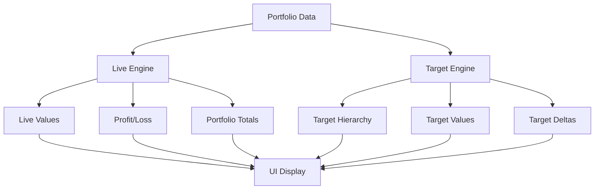

# Design Document

## Overview

This design restructures the portfolio calculation system into two distinct, independent calculation engines:

1. **Live Calculation Engine** - Handles real-time portfolio values based on actual holdings and live prices
2. **Target Calculation Engine** - Manages theoretical portfolio planning with hierarchical percentage allocations

The design ensures complete separation between these systems while maintaining clear data flow and efficient computation through selective caching.

## Architecture

### Core Calculation Separation

```typescript
interface CalculationEngines {
  live: LiveCalculationEngine;
  target: TargetCalculationEngine;
}

interface LiveCalculationEngine {
  calculateHoldingValue(holding: Holding): LiveValueResult;
  calculatePortfolioTotals(holdings: Holding[]): LivePortfolioTotals;
  calculateProfitLoss(holding: Holding, trades: Trade[]): ProfitLossResult;
}

interface TargetCalculationEngine {
  calculateTargetHierarchy(portfolio: Portfolio): TargetHierarchy;
  calculateHoldingTargets(holding: Holding, hierarchy: TargetHierarchy): TargetResult;
}
```

### Data Flow Architecture



## Components and Interfaces

### 1. Live Calculation Types

```typescript
interface LiveValueResult {
  value: number;           // Current market value (livePrice || price) * qty
  liveValue: number;       // Live price * qty (if available)
  dayChangeValue: number;  // Difference between live and manual value
  usedLivePrice: boolean;  // Whether live price was used
}

interface LivePortfolioTotals {
  totalAllocatedValue: number;    // Sum of all included holdings' live values
  sectionTotals: Map<string, number>;
  themeTotals: Map<string, number>;
  accountTotals: Map<string, number>;
}

interface ProfitLossResult {
  totalGain: number;           // Sum of all gains/losses
  totalGainPercent: number;    // Percentage gain/loss
  transactions: TransactionGain[];
}

interface TransactionGain {
  tradeId: string;
  purchasePrice: number;
  currentPrice: number;
  quantity: number;
  gain: number;
  gainPercent: number;
}
```

### 2. Target Calculation Types

```typescript
interface TargetHierarchy {
  portfolioTarget: number;                    // Target portfolio value
  sectionTargets: Map<string, SectionTarget>;
  themeTargets: Map<string, ThemeTarget>;
}

interface SectionTarget {
  percentage: number;      // User-set percentage
  targetValue: number;     // portfolioTarget * percentage
  allocatedValue: number;  // Current live value allocated to section
}

interface ThemeTarget {
  section: string;
  percentage: number;           // User-set percentage of section
  percentageOfPortfolio: number; // Calculated percentage of total portfolio
  targetValue: number;          // sectionTarget * percentage
  allocatedValue: number;       // Current live value allocated to theme
}

interface TargetResult {
  targetValue: number;      // Theme target * holding percentage
  targetDifference: number; // Current value - target value
  targetPercentDiff: number; // Percentage difference from target
}
```

### 3. Calculation Engine Implementations

#### Live Calculation Engine

```typescript
class LiveCalculationEngine {
  calculateHoldingValue(holding: Holding): LiveValueResult {
    const livePrice = holding.livePrice;
    const manualPrice = holding.price;
    const qty = holding.qty;
    
    const usedLivePrice = livePrice !== undefined;
    const effectivePrice = usedLivePrice ? livePrice : manualPrice;
    
    return {
      value: effectivePrice * qty,
      liveValue: (livePrice ?? manualPrice) * qty,
      dayChangeValue: usedLivePrice ? (livePrice - manualPrice) * qty : 0,
      usedLivePrice
    };
  }

  calculatePortfolioTotals(holdings: Holding[]): LivePortfolioTotals {
    const includedHoldings = holdings.filter(h => h.include);
    const sectionTotals = new Map<string, number>();
    const themeTotals = new Map<string, number>();
    const accountTotals = new Map<string, number>();
    
    let totalAllocatedValue = 0;
    
    for (const holding of includedHoldings) {
      const { liveValue } = this.calculateHoldingValue(holding);
      
      totalAllocatedValue += liveValue;
      sectionTotals.set(holding.section, (sectionTotals.get(holding.section) || 0) + liveValue);
      themeTotals.set(holding.theme, (themeTotals.get(holding.theme) || 0) + liveValue);
      accountTotals.set(holding.account, (accountTotals.get(holding.account) || 0) + liveValue);
    }
    
    return {
      totalAllocatedValue,
      sectionTotals,
      themeTotals,
      accountTotals
    };
  }

  calculateProfitLoss(holding: Holding, trades: Trade[]): ProfitLossResult {
    const currentPrice = holding.livePrice ?? holding.price;
    const holdingTrades = trades.filter(t => t.holdingId === holding.id);
    
    const transactions: TransactionGain[] = [];
    let totalGain = 0;
    let totalCostBasis = 0;
    let totalQuantity = 0;
    
    for (const trade of holdingTrades) {
      if (trade.type === 'buy') {
        const gain = (currentPrice - trade.price) * trade.qty;
        const gainPercent = trade.price > 0 ? ((currentPrice - trade.price) / trade.price) * 100 : 0;
        
        transactions.push({
          tradeId: trade.id,
          purchasePrice: trade.price,
          currentPrice,
          quantity: trade.qty,
          gain,
          gainPercent
        });
        
        totalGain += gain;
        totalCostBasis += trade.price * trade.qty;
        totalQuantity += trade.qty;
      }
    }
    
    const totalGainPercent = totalCostBasis > 0 ? (totalGain / totalCostBasis) * 100 : 0;
    
    return {
      totalGain,
      totalGainPercent,
      transactions
    };
  }
}
```

#### Target Calculation Engine

```typescript
class TargetCalculationEngine {
  calculateTargetHierarchy(portfolio: Portfolio): TargetHierarchy {
    const portfolioTarget = portfolio.settings.targetPortfolioValue ?? 0;
    const budgets = this.normalizeBudgets(portfolio.budgets);
    const liveEngine = new LiveCalculationEngine();
    const liveTotals = liveEngine.calculatePortfolioTotals(portfolio.holdings);
    
    // Calculate section targets
    const sectionTargets = new Map<string, SectionTarget>();
    for (const section of portfolio.lists.sections) {
      const sectionBudget = budgets.sections[section];
      const percentage = sectionBudget?.percent ?? 0;
      const targetValue = (percentage / 100) * portfolioTarget;
      const allocatedValue = liveTotals.sectionTotals.get(section) ?? 0;
      
      sectionTargets.set(section, {
        percentage,
        targetValue,
        allocatedValue
      });
    }
    
    // Calculate theme targets
    const themeTargets = new Map<string, ThemeTarget>();
    for (const theme of portfolio.lists.themes) {
      const themeBudget = budgets.themes[theme];
      const section = portfolio.lists.themeSections?.[theme];
      
      if (section && themeBudget?.percentOfSection) {
        const sectionTarget = sectionTargets.get(section);
        if (sectionTarget) {
          const percentage = themeBudget.percentOfSection;
          const targetValue = (percentage / 100) * sectionTarget.targetValue;
          const percentageOfPortfolio = portfolioTarget > 0 ? (targetValue / portfolioTarget) * 100 : 0;
          const allocatedValue = liveTotals.themeTotals.get(theme) ?? 0;
          
          themeTargets.set(theme, {
            section,
            percentage,
            percentageOfPortfolio,
            targetValue,
            allocatedValue
          });
        }
      }
    }
    
    return {
      portfolioTarget,
      sectionTargets,
      themeTargets
    };
  }

  calculateHoldingTargets(holding: Holding, hierarchy: TargetHierarchy): TargetResult | null {
    if (!holding.targetPct || !holding.include) {
      return null;
    }
    
    const themeTarget = hierarchy.themeTargets.get(holding.theme);
    if (!themeTarget) {
      return null;
    }
    
    const targetValue = (holding.targetPct / 100) * themeTarget.targetValue;
    const liveEngine = new LiveCalculationEngine();
    const { liveValue } = liveEngine.calculateHoldingValue(holding);
    
    const targetDifference = liveValue - targetValue;
    const targetPercentDiff = targetValue > 0 ? (targetDifference / targetValue) * 100 : 0;
    
    return {
      targetValue,
      targetDifference,
      targetPercentDiff
    };
  }

  private normalizeBudgets(budgets?: Portfolio['budgets']) {
    // Implementation matches existing normalizeBudgets function
    return {
      sections: this.normalizeBudgetCollection(budgets?.sections),
      accounts: this.normalizeBudgetCollection(budgets?.accounts),
      themes: this.normalizeBudgetCollection(budgets?.themes)
    };
  }
}
```

## Data Models

### Enhanced Holding Interface

```typescript
interface Holding {
  // Existing fields remain unchanged
  id: string;
  section: string;
  theme: string;
  // ... other existing fields
  
  // Purchase history for profit/loss calculations
  purchaseHistory?: PurchaseRecord[];
}

interface PurchaseRecord {
  date: string;
  price: number;
  quantity: number;
  tradeId?: string; // Link to trade record
}
```

### Calculation Result Aggregation

```typescript
interface HoldingCalculationResult {
  holding: Holding;
  live: LiveValueResult;
  profitLoss?: ProfitLossResult;
  target?: TargetResult;
  percentages: {
    ofPortfolio: number;
    ofSection: number;
    ofTheme: number;
  };
}

interface PortfolioCalculationResult {
  holdings: HoldingCalculationResult[];
  totals: LivePortfolioTotals;
  hierarchy: TargetHierarchy;
}
```

## Error Handling

### Calculation Error Types

```typescript
enum CalculationErrorType {
  INVALID_PRICE = 'INVALID_PRICE',
  INVALID_QUANTITY = 'INVALID_QUANTITY',
  MISSING_TARGET_DATA = 'MISSING_TARGET_DATA',
  CIRCULAR_DEPENDENCY = 'CIRCULAR_DEPENDENCY'
}

interface CalculationError {
  type: CalculationErrorType;
  message: string;
  holdingId?: string;
  field?: string;
}

interface CalculationResult<T> {
  data?: T;
  errors: CalculationError[];
  warnings: string[];
}
```

### Error Handling Strategy

1. **Graceful Degradation**: Invalid data results in zero values rather than crashes
2. **Error Reporting**: Collect and report all calculation errors for debugging
3. **Fallback Values**: Use manual prices when live prices are invalid
4. **Validation**: Validate inputs before calculation to prevent errors

## Testing Strategy

### Unit Testing Approach

1. **Engine Testing**: Test each calculation engine independently
2. **Integration Testing**: Test engine coordination and data flow
3. **Edge Case Testing**: Test with invalid/missing data scenarios
4. **Performance Testing**: Ensure calculations remain fast with large portfolios

### Test Data Scenarios

```typescript
interface TestScenario {
  name: string;
  portfolio: Portfolio;
  expectedLive: Partial<LivePortfolioTotals>;
  expectedTarget: Partial<TargetHierarchy>;
  expectedErrors: CalculationErrorType[];
}

const testScenarios: TestScenario[] = [
  {
    name: "Basic live calculations",
    portfolio: createTestPortfolio({
      holdings: [
        { ticker: "AAPL", price: 100, qty: 10, livePrice: 105 }
      ]
    }),
    expectedLive: {
      totalAllocatedValue: 1050
    },
    expectedTarget: {},
    expectedErrors: []
  },
  {
    name: "Target hierarchy calculations",
    portfolio: createTestPortfolio({
      settings: { targetPortfolioValue: 10000 },
      budgets: {
        sections: { "Core": { percent: 80 } },
        themes: { "Tech": { percentOfSection: 50 } }
      }
    }),
    expectedTarget: {
      portfolioTarget: 10000,
      sectionTargets: new Map([["Core", { targetValue: 8000 }]]),
      themeTargets: new Map([["Tech", { targetValue: 4000 }]])
    },
    expectedErrors: []
  }
];
```

### Performance Considerations

1. **Caching Strategy**: Cache calculation results with invalidation on data changes
2. **Selective Updates**: Only recalculate affected parts when data changes
3. **Lazy Evaluation**: Calculate target values only when target portfolio value is set
4. **Memoization**: Memoize expensive calculations like profit/loss aggregation